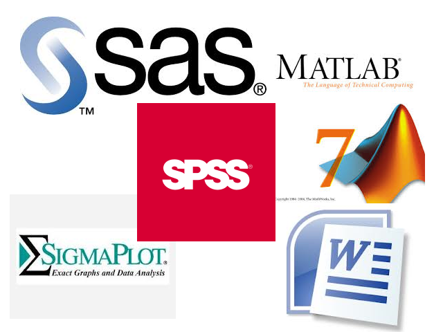
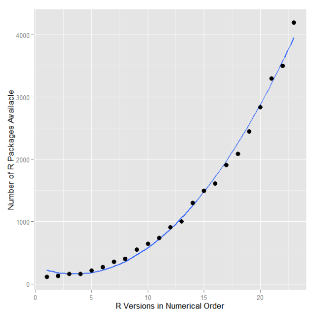

    

### Find this talk [here]()

### Made with [Slidify](http://slidify.org/); the code here [http://bit.ly/ostalking](https://github.com/SChamberlain/posterstalks/blob/gh-pages/esa2013/openscience/index.Rmd)

### Press "o" to bring up all slides - <i class="icon-arrow-left"> &nbsp; </i><i class="icon-arrow-right"></i> to navigate

---

## Closed source software is great! 
  

---

## Yeah, but open source is better for a lot of reasons

---

## It's free!

---

## Bugs can get fixed quickly

---

## User community helps each other (see [Stackoverflow](http://stackoverflow.com/))

### i.e., you can get help much faster than with closed-source software

---

## Additional functionality added as fast as you can write the code

 
[link](http://r4stats.com/2013/03/19/r-2012-growth-exceeds-sas-all-time-total/)

---

## Open source is forkable

---

## Companies are supporting open source
  

AT&T hearts open source

  

  
[@tenderlove](https://twitter.com/tenderlove) contributor to Ruby and Ruby on Rails

---

## Supporting open source ≠ less profit

---

## Academics making open source ≠ less power

---

## Be a good open source citizen

+ Contribute code
 
+ Can't code? Contribute documentation
 
+ Report bugs
 
+ Stackoverflow/etc. - Do your homework before asking questions

---
 
## Making open source software

+ Version control 
+ Collaboration
+ Documentation
+ Development framework
+ Testing
+ Give it a proper home

---

## R 

+ Version control: ideally [git](http://git-scm.com/)
+ Collaboration: [Github](https://github.com/)
+ Documentation: [roxygen2](http://cran.r-project.org/web/packages/roxygen2/index.html)
+ Development framework: [devtools](https://github.com/hadley/devtools)
+ Testing: [testthat](https://github.com/hadley/testthat)
+ Give it a proper home: [Github](https://github.com/), [Bitbucket](https://bitbucket.org/)

---

## Building community in open source

+ Soooooo important (unlike companies, OS needs people, redundancy when some lose interest, etc.)
+ Be nice! (super important)
+ Make it easy to contribute (good docs, respond to pull requests, etc.)
+ Google groups/or similar
+ Get a Stackoverflow tag

---

## Getting credit for software development

+ There currently are very few incentives for software dev
+ Papers give credit, but not best way to talk about software
+ Shouldn't we get credit for the software itself - not papers about the software?
+ NSF starting to recognize other products in academia, including data, physical collections, curriculum material and **SOFTWARE**!!! See [here](http://www.nsf.gov/pubs/policydocs/pappguide/nsf11001/gpg_2.jsp#dmp)

---

## Licenses 

+ Use permissive licenses
+ No one best license - do your research
+ GitHub has help for you on this at [http://choosealicense.com/](http://choosealicense.com/)
+ OS licenses on the Open Source Initiative site [here](http://opensource.org/licenses)
