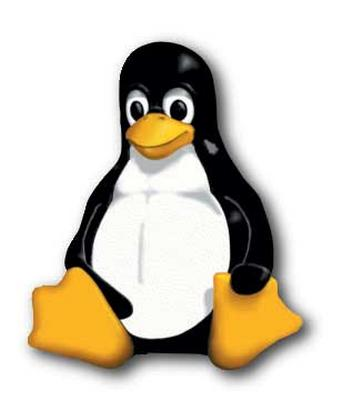

    

### Find this talk [here]()

### Made with [Slidify](http://slidify.org/); the code [here](https://github.com/SChamberlain/posterstalks/blob/gh-pages/esa2013/openscience/index.Rmd)

### Press "o" to bring up all slides - use <i class="icon-arrow-left"> &nbsp; </i><i class="icon-arrow-right"></i> to navigate

---

<!-- it's free! -->
## Why open source?

---

<!-- bugs can get fixed quickly -->
## Bugs can get fixed quickly

---

## Can get lots of users potentially

### Which means

+ find bugs faster
+ user community start to help each other (see [Stackoverflow](http://stackoverflow.com/))
+ additional functionality added - crowdsourcing ideas
+ 

---
<!-- even tenderlove gets paid to make open source -->

## Companies are supporting open source
  

AT&T hearts open source

  

  
[@tenderlove](https://twitter.com/tenderlove) lovin on Ruby and Ruby on Rails

---
 
## Making open source software

### R 

+ Overall development: [devtools](https://github.com/hadley/devtools)
+ Testing: [testthat](https://github.com/hadley/testthat)
+ Documentation: [roxygen2](http://cran.r-project.org/web/packages/roxygen2/index.html)
+ Versioning: ideally [git](http://git-scm.com/)
+ Collaborative development: [Github](https://github.com/)

---

### Python
+ asdf
+ adsf
+ asdf
+ adf

---

## credit for software dev
+ no incentives for software dev now

---

+ papers give credit, but not best way to talk about software

---

+ NSF starting to recognize other products in academia

---

## licenses 
+ Creative Commons, MIT, etc
+ use permissive licenses
+ github has help for u on this

---

## Use open source software

+ Likely made by other academics

---

+ Be a good citizen

---

+ Report bugs

---

+ Do your homework before asking questions

---

+ It's almost always better than closed software

---

