<!-- 
Have a 30 min slot, SHOOTING FOR 25 minutes
-->

<br><br><br><br>
<center>
### Find this talk on the web here [http://bit.ly/sfualm](http://bit.ly/sfualm)

### Made with [Slidify](http://slidify.org/); the code [here](https://github.com/SChamberlain/posterstalks/blob/gh-pages/sfuoa/index.Rmd)

### Press "o" to bring up all slides - <i class="icon-arrow-left"> &nbsp; </i><i class="icon-arrow-right"></i> to navigate

### Press "w" to change aspect ratios

### License: CC-BY 3.0 (i.e., reuse, and credit)
</center>
<center>
<a href="http://creativecommons.org/licenses/by/3.0/"></img></a> 
</center>


<!--
The plan

+ Pose the problem: jif doesn't capture article level impact.  Jif not open., easily gamed, single entity controlling
+ the solution: altmetrics, open versions, transparent, diverse impacts, 
+ relation to open access: see ross' paper, can give OA journals some visibility in absence of impact factor
+ really not being used for hiring decisions now, but possibly soon? It seems inevitable
+ details: what do they look like? How are they collected.
+ wrap up
-->

---

## There are a lot of papers out there
<br>
<center></center>

<font size="6"><a href="http://bit.ly/18pwYPa">Cali.org, Eric Molinsky</a></font>

---

<br><br><br>

<font size="14"><center> How do we sort out the good from the bad...<br>
and discover the impactful papers </center></font>

---

## We rank journals using the JIF
<br>

<div class="row">
  </img>
  &nbsp;&nbsp;&nbsp;
  </img>
</div>

---

<br><br><br>

<font size="14"><center> But there are problems </center></font>

--- 

## JIF is not open <br> single for-profit w/o transparency
<center></center>

---

## Measured at the journal level
<br>
<center>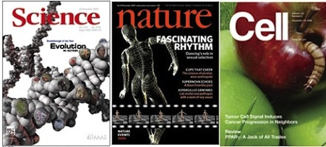</center>

---

## Articles within journals vary in impact
<br>

<center><em><font size="10">"15% of a journal's articles get 50% of the citations"</font></em></center>
<br><br><br><br><br><br>
<font size="4">
[1]: Seglen, P. O. (1992), The skewness of science. J. Am. Soc. Inf. Sci., 43: 628–638. 
</font>

---

## We judge papers, people, schools on IF's
<br>
<center></center>

--- 

## Frustration with the JIF

<br>
<center>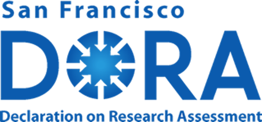</center>

* 9,596 signatories
* Don't use JIF
* Value all research outputs

<!-- <center><h2>9,596 signatories</h2></center>
<center><h2>Don't use JIF</h2></center>
<center><h2>Value all research outputs</h2></center>
<center><h2>Value all research outputs</h2></center> -->

---

<br><br><br>

<font size="14"><center> So what can be done? </center></font>

---

<br><br><br>

<font size="14"><center> There's this thing called the internet... </center></font>

---

## Scholarly activities increasingly moving to the web

>- Journals are more or less all online
	- Many companies collecting metrics on internet use
	- We love to share things on the web
	- CV's are online
	- Etc., etc.

>- We can listen to these conversations

---

<br><br><br>

## Altmetrics: <font color="grey"><em>new ways of measuring impact</em></font>
<br><br>
## Article-level metrics: <font color="grey"><em>altmetrics on a scholarly paper</em></font>

---

## Measured on article level

<center>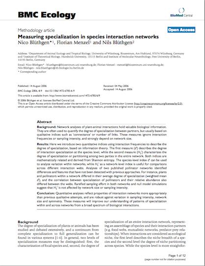</center>

---

## Measured at <span class="strikeout">article</span> *object* level

<div class="row" align="center">
	</img>
	&nbsp;&nbsp;
	</img>
	&nbsp;&nbsp;
	</img>
</div>
<div class="row" align="center">
	</img>
	&nbsp;&nbsp;&nbsp;&nbsp;&nbsp;&nbsp;&nbsp;&nbsp;&nbsp;&nbsp;
	</img>
</div>

---

## ImpactStory just got NSF grant to track software reuse/impact

<center>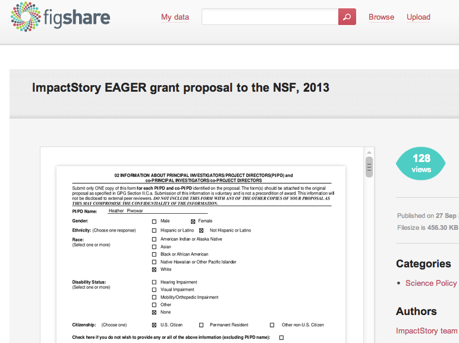</center>

---

<br>

<center>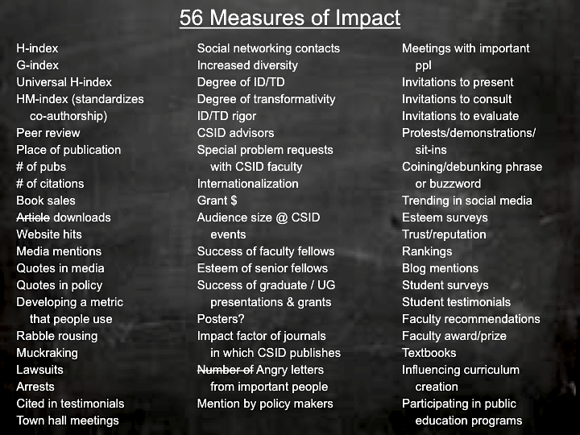</center>


<br>
<font size="4">
[1]: <a href="http://cas-csid.cas.unt.edu/?p=4475">Keith Brown, CSID Blog, 2013-05-22</a> 
</font>

---

## <font color="black">Altmetrics measure diverse impacts</font>
<br>
* <font color="blue">Usage</font>: html, xml, pdf downloads
<br><br><br>
* <font color="orange">Citations</font>: Scopus, PubMed Central, Crossref
<br><br><br>
* <font color="green">Social media</font>: Twitter, Mendeley, Facebook, etc.

---

## <font color="black">Altmetrics measure scholarly vs. public impact</font>
<br>
* <font color="steelblue">Scholarly</font>: Citations, shares by scholars, etc.
<br><br><br>
* <font color="blue">Public</font>: News articles, shares by non-scholars, etc.

---

## Diverse set of providers
<br>

<div class="row">
  </img>
  &nbsp;&nbsp;&nbsp;&nbsp;
  </img>
  &nbsp;&nbsp;
  </img>
  &nbsp;&nbsp;&nbsp;&nbsp;
  </img>
</div>

---

## Which...

>* Serve 
	* Universities: Plum Analytics
	* Publishers: Altmetric.com, ImpactStory
	* Individuals: ImpactStory
	* Readers: PLOS ALM
>* Vary in data openness
	* Open data: [PLOS](http://alm.plos.org/)
	* Just opened up: Plum Analytics (see [here](https://plu.mx/developers))
	* Some open data: Altmetric.com

---

<br><br><br>

<font size="14"><center> What do altmetrics look like? <br><br> using a set of 500 papers from PLOS One published in 2010 </center></font>

<!-- details: what do they look like? How are they collected. -->

---

## Usage

* html, xml, pdf downloads, collected by publishers


```r
plot_density(outdf, source = c("counter_pdf", "counter_html"), color = c("#DBAC6A", 
    "#A06D34"), plot_type = "histogram")
```

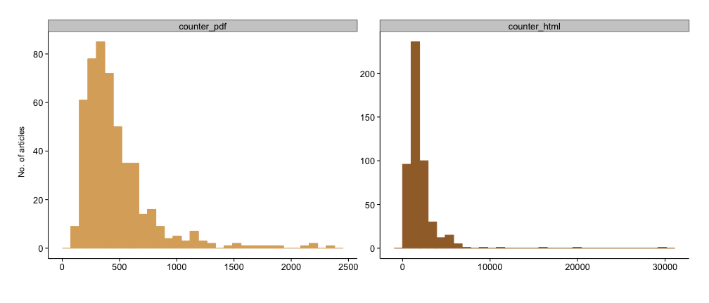 


---

## Citation

* Scopus, PubMed Central, Crossref


```r
plot_density(outdf, source = c("crossref_citations", "pubmed_citations", "scopus_citations"), 
    color = c("#EFA5A5", "#CFD470", "#B2C9E4"), plot_type = "histogram")
```

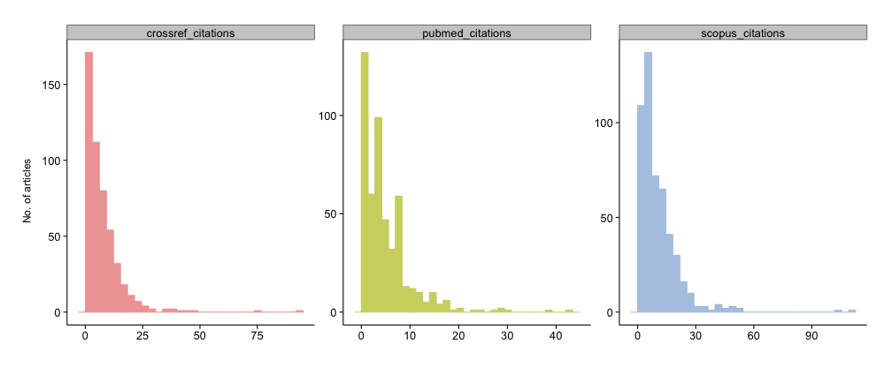 


---

## Social media

* Twitter, Mendeley, Facebook, etc., collected by altmetrics aggregators


```r
plot_density(outdf, source = c("twitter_total", "mendeley_total", "facebook_total"), 
    color = c("#EFA5A5", "#CFD470", "#B2C9E4"), plot_type = "histogram")
```

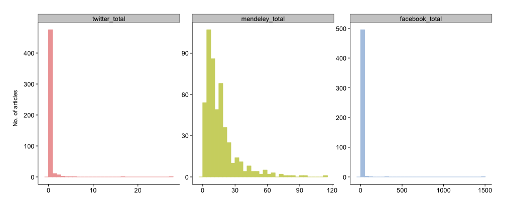 


---

## Accumulation through time

<center>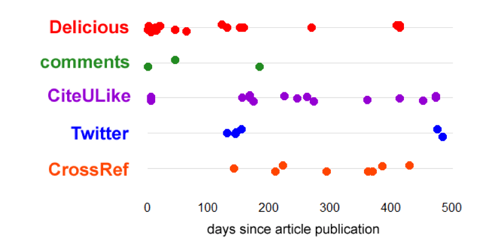</center>

<br>
<font size="4">
[1]: <a href="http://arxiv.org/html/1203.4745v1">Priem, Piwowar & Hemminger, arXiv:1203.4745, Fig. 8</a> 
</font>

---

## Correlation

<center>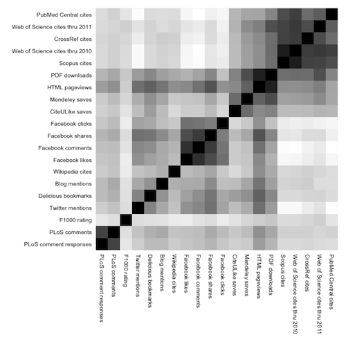</center>

<font size="4">
[1]: <a href="http://arxiv.org/html/1203.4745v1">Priem, Piwowar & Hemminger, arXiv:1203.4745, Fig. 9</a> 
</font>

---

<br><br><br>

<font size="14"><center> How are altmetrics being used? </center></font>

<!-- really not being used for hiring decisions now, but possibly soon? It seems inevitable. being
used for filtering what papers to read
used for ????
-->

---

## Plum Analytics 

* Institutional subscribers w/ altmetrics dashboards for their faculty/staff
* Don't know if they evaluate them on these though?

<center></center>

---

## ImpactStory

* Pushing their profiles as the new CV

<center></center>

---

## Altmetric.com

* Publishers display metrics

<center></center>

---

<br><br><br>

<font size="14"><center> story time </center></font>

---

## A story about real impact

<center></center>
<br><br><br><br>
<font size="8"> <a href="http://www.slideshare.net/CameronNeylon/research-assessment-to-support-research-impact">From this talk by Cameron Neylon</a> </font>

---

## Article in w/o strikingly large page views

<center>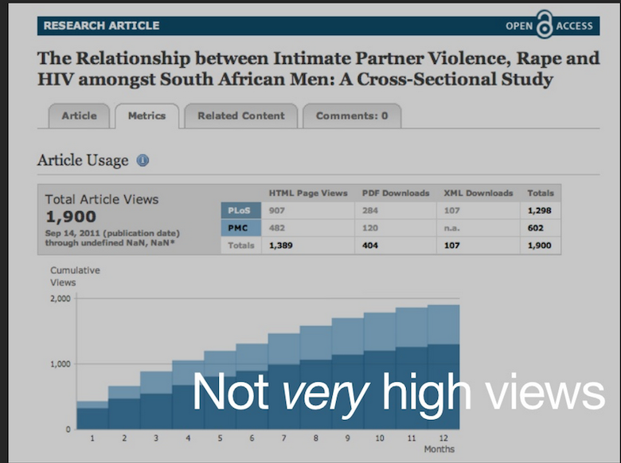</center>

---

## But with highly relevant interactions

<center></center>

---

<br><br><br>

<font size="14"><center> end story, see <a href="http://www.slideshare.net/CameronNeylon/research-assessment-to-support-research-impact">here</a> for his slides </center></font>

---

## Anecdotes

>* Academics reporting altmetrics on their CV's and say that it *may* have helped them get tenure
>* Stories of use in hiring/tenure decisions - but no hard data (e.g., [this](http://blogs.scientificamerican.com/information-culture/2013/02/13/providing-context-for-the-metrics-used-to-evaluate-the-scientific-literature/))
>* Some have used altmetrics on their application to be an editor for <a href="#">PeerJ</a>
>* [Wellcome Trust](http://www.wellcome.ac.uk/) has been thinking about using for evaluations
>* [Amy Brand @ Harvard](http://www.faculty.harvard.edu/about-office/our-team) on evaluations - don't look at journal name; do look at citations - other products "leaking in"
>* [SSRN](http://www.ssrn.com/) - uses downloads as a metric for relative impact/use
>* Wikipedia mentions can be particularly interesting - *a textbook on the web*

---
<br><br><br>

<font size="14"><center> What does this have to do with OA? </center></font>

<!-- relation to open access: see ross' paper, can give OA journals some visibility in absence of impact factor -->

--- 

## Many OA journals don't select for impact

Quickly accumulating altmetrics can help filter articles *after* publication

<div class="row" align="center">
  </img>
  <a href="http://www.plosone.org/article/info%3Adoi%2F10.1371%2Fjournal.pone.0073791">link</a>
</div>
<div class="row" align="center">
  </img>
  <a href="http://www.plosone.org/article/info%3Adoi%2F10.1371%2Fjournal.pone.0023019">link</a>
</div>
<!-- <center></center>
<center></center> -->
<!-- [doi:10.1371/journal.pone.0073791](http://www.plosone.org/article/info%3Adoi%2F10.1371%2Fjournal.pone.0073791)
[doi:10.1371/journal.pone.0023019](http://www.plosone.org/article/info%3Adoi%2F10.1371%2Fjournal.pone.0023019) -->

---

<br>
*7 of 10 most popular articles in 2012 as measured by altmetrics from Altmetric.com were open access - none were form Science/Nature - majority of chatter about them from non-scientists* - wouldn't have been apparent from citations
<br><br><br><br>
<font size="4">
[1]: <a href="http://asis.org/Bulletin/Apr-13/AprMay13_Mounce.html">Ross Mounce 2013, BAIST</a> 
</font>

---

## Filtering using altmetrics

* Largely unrealized - especially useful in mega OA journals
* [Jevin West](http://octavia.zoology.washington.edu/people/jevin/Homepage.html)

<center></center>
<font size="4">
[1]: <a href="http://article-level-metrics.plos.org/files/2013/10/West.pdf">link</a> 
</font>

---

<br><br><br>

<font size="14"><center> Programmatic access to altmetrics </center></font>
<br><br><br>
<center></center>

--- 

## Data via alm interface to PLOS ALM

```coffee
library(alm)
alm(doi="10.1371/journal.pone.0029797")
```

```coffee
Slot "summary":
  views shares bookmarks citations
1 29229    237        51         7

Slot "data":
                .id  pdf  html shares groups comments likes citations total
1         bloglines   NA    NA     NA     NA       NA    NA         0     0
2         citeulike   NA    NA      1     NA       NA    NA        NA     1
3          connotea   NA    NA     NA     NA       NA    NA         0     0
4          crossref   NA    NA     NA     NA       NA    NA         7     7
5            nature   NA    NA     NA     NA       NA    NA         4     4
...
```

<font size="4">
[1]: <a href="http://ropensci.org/packages/#altmetrics">Get the <code>alm</code> R package here</a> 
</font>

---

<br><br><br>

<font size="14"><center> Wrapping up </center></font>

--- 

## What I'm worried about

>* Data consistency: aggregators don't collect data in the same way, e.g., Twitter => ImpactStory (Topsy), Altmetric (Twitter API), PlumAnalytics (Topsy), PLOS ALM (??)
>* Data provenance: aggregators tracking this, but newcomers may not - some provenance we'll never know
>* Long-term sustainability: Web resources are ephemeral - how do we ensure data persistence?
>* Openness: 
	* open data
	* transparent calculations

---

## ¿Standards for almetrics?

* NISO to the rescue!!!
* $207K grant from Sloan Foundation 
* Standards
	* Granularity or data collected
	* Duration of metrics
	* Role of social media in altmetrics
	* Data sharing

<font size="4">
[1]: <a href="http://www.niso.org/news/pr/view?item_key=72efc1097d4caf7b7b5bdf9c54a165818399ec86">NISO Altmetrics Standards Site</a> 
</font>

---

<div class="row">
	
	&nbsp;&nbsp;&nbsp;&nbsp;&nbsp;&nbsp;&nbsp;&nbsp;&nbsp;&nbsp;
	
</div>

---

## Resources

* Follow the #altmetrics hashtag on Twitter, Google+
* Blogs of [PLOS ALM](URL), [Altmetric.com](URL), [ImpactStory](URL), and [PlumAnalytics](URL)
* [Altmetrics.org](http://altmetrics.org)
* [R packages for programmatic access to altmetrics data](http://ropensci.org/packages/#altmetrics)
